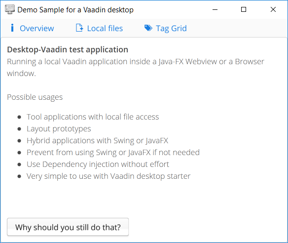

# desktop-vaadin

Desktop-vaadin is a Spring Boot Starter project to write a desktop application in java and use Vaadin for the UI. It uses spring boot and maven to create a single runnable jar file with an embedded web server and show the vaadin ui in a JavaFX Webview or in a browser tab.


## Getting Started

+ Get the repository from github.
```
git clone https://github.com/hrichtersource/desktop-vaadin.git
```
+ Navigate in a console to the main folder "desktop-vaadin".
```
cd PathToGitRepository/desktop-vaadin
```
+ Build the maven multi project
```
mvn clean install
```
+ Run sample application
```
cd desktop-vaadin-sample
mvn spring-boot:run
```




## Prerequisites

+ Java 8
+ Maven

## Development

How to create your own desktop application

**Coming soon**


## Deployment

+ It's a desktop application. Just double click the standalone jar file from target folder or start it on the console with 
```
java -jar vaadin-desktop-sample-0.0.1-SNAPSHOT.jar
```
You only need Java 8 on the machine to run it. No installation is needed.


## Built With

* [Spring boot](https://start.spring.io) - Create stand-alone Spring applications
* [Maven](https://maven.apache.org/) - Dependency and build management
* [Git](https://git-scm.com/) - Get it from Github

## Authors

* **Holger Richter** - *Idea and initial work*


## License

This project is licensed under the GPL3 License - see the [LICENSE](LICENSE) file for details
